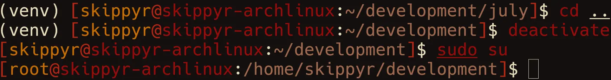

# July
## About
This repository contains the source code of July, a simple custom theme for the
ZSH shell.

Here is a preview that you can check it out:



Please note that the colors used in the theme may look different in your setup,
as they depend on your terminal emulator's theme. The theme used in the preview
is [Flamerial](https://github.com/skippyr/flamerial).

In the prompt, you will find:
- Your host and user names.
- Your current directory path.

## Installation
### Dependencies
In order to install and this software properly, the following dependencies
must be installed:

- `git`: required to clone this repository.

### Procedures
Using a command-line utility, follow these steps:

- Clone this repository using `git`.

  ```bash
  git clone --depth 1 https://github.com/skippyr/july                          \
                      ~/.local/share/zsh/themes/july
  ```

  The option `depth` with value `1` specifies to `git` that you only want to
  download the latest commit instead of the whole commit that it would do by
  default.

- Add the following source rule to your `~/.zshrc` file. Ensure to not be
  sourcing any other theme to avoid conflicts.

  ```bash
  source ~/.local/share/zsh/themes/july/july.zsh-theme
  ```

- Open a new ZSH session. At this point, the theme should be running and be
  ready for you to use.

## Support
Report issues, questions and suggestions through its [issues page](https://github.com/skippyr/july/issues).

## Copyright
This software is under the MIT license. A copy of the license is bundled with
the source code.
