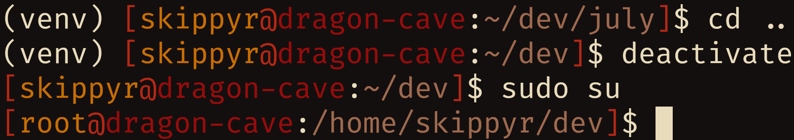

# July
## About
A simple theme for the ZSH shell.


## Installation
-   Clone this repository.
```bash
git\
  clone --depth=1 https://github.com/skippyr/july\
  ~/.local/share/zsh/themes/july
```

-   Add the following source rule to your `~/.zshrc` file. Ensure to not source
    other theme.

```bash
source ~/.local/share/zsh/themes/july/july.zsh-theme
```

-   Reopen ZSH.

## Copyright
This software is under the MIT license. A copy of the license is bundled with
the source code.
